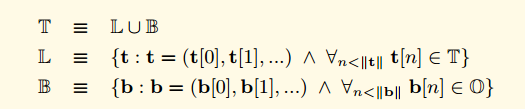

# RLP
RLP是Recursive Length Prefix的简写。是以太坊中的序列化方法，以太坊的所有对象都会使用RLP方法序列化为字节数组。

字节数组中数据部分的每个元素均为`ascii`编码，即小于127

## 元素集合：T

`T`为序列化后的对象的集合，元素分为两种:
* `B`：代表了所有可能的字节数组（一些字节的序列，这些字节构成了某个特定的元素，比如一个字符，一个字符串，或一个数字）
* `L`：递归列表结构，其中所有元素为T类型，即`B`类型或`L`类型

我们使用两个子函数来定义RLP函数，这两个子函数分别处理上面说到的两种结构(`L`或者`B`)


### 类型B的处理函数

伪代码如下：
```go
func Rb(bytes []byte) []byte {
	if len(bytes) == 1 && bytes[0] < 127 {
		return bytes
	}
	if len(bytes) < 56 {
		// 数据部分字节数组长度小于56时，前缀为128+数组长度
		bytes = append([]byte{uint8(128 + len(bytes))}, bytes...)
	} else {
		// 前缀1：存储字节数组长度的数值需占用的字节数
		var lbe int
		lbe = len(BE(len(bytes)))
		// 前缀2：示字符数组长的十六进制数
		var be []byte
		be = BE(len(bytes))
		// 附上前缀2
		bytes = append(be, bytes...)
		// 附上前缀1
		bytes = append([]byte{uint8(183 + lbe)}, bytes...)
	}
	return bytes
}
```
* (a).（b,c).(d,e) = (a,b,c,d,e) 代表了concat的操作，也就是字符串的相加操作。 "hello "+"world" = "hello world"
* BE(x)函数其实是去掉了前导0的大端模式。 比如4个字节的整形0x1234用大端模式来表示是 00 00 12 34 那么用BE函数处理之后返回的其实是 12 34. 开头的多余的00被去掉了。

#### 序列化后数值的语义
当数据x被序列化后，即成为字节序列。
* 若数值在区间[0,128)，表明该处为一个ascii字符
* 若数值在区间[128,192)，表明其后有一个字节数组
* 若数值（n）在区间[128,183)，表明该处的数据由两部分构成，第一个字节数值n及其后一个长度为 n-128 的字符序列
* 若数值（n）在区间[183,192)，表明该处的数据由三部分构成
  * 第一部分，同时也为第一个字节：lbe = len(BE(len(x)))，即存储字节数组长度的数值需占用的字节数
  * 第二个部分，占用lbe个字节：存储表示字符数组长的十六进制数
  * 第三个部分：数据本身

### 类型L的处理函数


伪代码如下：
```go
func Rl(x []T) []byte {
	var bytes []byte
	// 先序列化并拼接所有元素成一个字节数组
	for _, member := range x {
		bytes = append(bytes, RLB(member)...)
	}
	// 加上前缀
	if len(bytes) < 56 {
		// 拼接后数据部分字节数组长度小于56时，前缀为192+数组长度
		bytes = append([]byte{uint8(192 + len(bytes))}, bytes...)
	} else {
		// 前缀1：存储字节数组长度的数值需占用的字节数
		var lbe int
		lbe = len(BE(len(bytes)))
		// 前缀2：示字符数组长的十六进制数
		var be []byte
		be = BE(len(bytes))
		// 附上前缀2
		bytes = append(be, bytes...)
		// 附上前缀1
		bytes = append([]byte{uint8(247 + lbe)}, bytes...)
	}
	return bytes
}
```

#### 文档数值的语义
* 若数值（n）在区间[192,256)，表明其后有一个对象列表
* 若数值（n）在区间[192,247)，表明该处的数据由两部分构成，第一个字节数值n及其后一个长度为 n-192 的字符序列
* 若数值（n）在区间[247,256)，表明该处的数据由三部分构成
  * 第一部分，同时也为第一个字节：lbe = len(BE(len(x)))，即存储字节数组长度的数值需占用的字节数
  * 第二个部分，占用lbe个字节：存储表示字符数组长的十六进制数
  * 第三个部分：数据本身