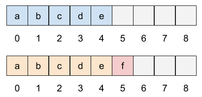
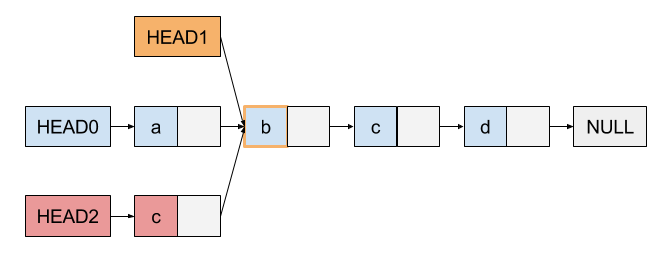

# 0. 标记
* 💡：显式声明是我的而不是原文作者的观点，可能欠缺严谨性
* ❓：存疑点
# 1. 简介
来源：[Functional Go: 持久化数据结构简介 [1] - 持久化数据结构简介](https://io-meter.com/2016/09/03/Functional-Go-persist-datastructure-intro/)
持久化(Persistent)数据结构又叫不可变(Immutable)数据结构，顾名思义，这类数据结构的内容是不可变的。 也就是说，对于这类数据结构的修改操作，都会返回一个新的副本，而原来的数据结构保存的内容不会有任何改变。

**状态机：** 我们现在所编写的所有程序，都可以看作是一个状态机，也就是说在程序运行的过程的每一个时刻，程序本身可以被看作存在一个状态(State)，我们的语句作用在当前状态上，从而不断地产生出进一步的状态，由此循环往复。

## 持久化数据结构的意义
**需要解决的问题**
1. 操作的原子性：我们的有些行为可以看作一系列对状态的修改，比如说通过一个函数内的一系列操作来实现一个功能，先读出数据库里的内容来进行修改等。这时，我们希望这一连串操作是原子的。也就是说整个过程要么全部成功，要么全部失败。这样的要求在数据库里是通过事务(Transaction)来实现的。
2. 并发处理：在并发程序中，一个函数的执行可能会带有副作用——同样的输入和函数，得到的返回结果却可能不一样。比方说，将一个数组传递进一个函数进行遍历处理，在函数执行的过程中，另一个线程修改了数组的内容，这样就产生了线程同步等复杂的问题，增加了程序出现问题的可能性，也增加了 Debug 的难度。

### 持久化数据结构带来的好处
持久化数据结构天然解决了操作原子性问题与并发处理问题。

持久化数据结构将原来的状态保存在不可变的数据结构中，只有当整个操作成功完成再将生成的新状态替换回去，这样系统就不会进入过程错误导致的中间状态。由于持久化数据结构本身不会被修改，因此将它传入一个函数是安全的，任何对他的修改都表现在一个新的对象上， 因此你传入函数的输出并不会被影响。

### 持久化数据结构的缺陷
1. 空间开销：由于持久化数据结构在修改时需要生成新的对象，因此往往会比普通数据结构更加耗费内存空间。因此， 任何持久化数据结构在设计上都要考虑如何节省空间这一问题。
2. 更复杂的数据结构：持久化数据结构往往是在原始数据结构上的包装，通过更复杂的操作保证原始数据结构的数据的不变性， 这不但体现在修改操作上，也体现在读取操作上。因此持久化数据结构的读写速度往往会慢于普通数据结构， 其实现也更复杂。

# 2. 应用
来源：[Functional Go: 持久化数据结构简介 [1] - 持久化数据结构的应用](https://io-meter.com/2016/09/03/Functional-Go-persist-datastructure-intro/)
## 增量视图更新
在 React + Flux 模型中，不可变数据结构还被用来加速状态改变的对比，因为 React 依赖于对比前后两个状态之间的改变来发现需要对 Virtual DOM 进行的最小改变，因此必须要保留每一次修改之后的状态。 所有的操作都必须通过setState方法进行，很难保证之前的状态没有被其他地方意外的修改，而对比本身也是耗时的。

但是在引入ImmutableJS后，每个 View 的状态就可以很安全的保存起来了。由于在 React 里，state 改变总是从一个最初的状态衍生而来的一系列状态，在对前后两个状态进行递归的比较时，如果两个对象的引用是一样的， 那么它们一定是一个不可变的对象，如果两个对象的引用不一致，那么一定经过了修改。因此通过这样的优化可以加速比较的过程。

## 增量状态备份
持久化数据结构的另一个应用是实现文件系统的 Copy on Write 功能，很多文件系统以及虚拟机(VirtualBox)和容器(Docker) 都提供 Snapshot 的功能，也就是说你可以保存文件系统在某一时刻的完整状态并在未来某个时间方便地恢复到当前状态。 这在部署服务的时候非常有用——如果新上线的系统出现问题，我们可以快速简单地回复到原来正常的状态。 传统的 CoW 实现是在某一文件修改的过程时候再复制它，这种实现在遇到比较大的文件时是比较浪费空间的。

然而很多持久化数据结构的实现本身就考虑到了节省空间的问题，因此可以很大程度上缓解这一问题。也就是说， 对于一个文件，我们可以只在写入的时候复制其中一小部分来实现块级别的 CoW。

## 提高并发性
持久化数据结构的最广泛的应用还是在并发编程当中，结合函数式编程的模型实现高性能且安全易于预测的代码编写。 在一些多人联机系统(协作工具、联机游戏)当中，多个用户会并发地对某一个中心的状态进行修改，而这个中心状态还需要定期的保存。 使用不可变数据结构，每一个被传入的状态都是当时状态的不可变的快照，因此我们可以安全的在一个新的线程上执行保存操作。 这提高了我们程序的并发性。

❓最终中心状态怎么选取

# 3. 实现
来源：[Functional Go: 持久化数据结构简介 [1] - 持久化数据结构的实现](https://io-meter.com/2016/09/03/Functional-Go-persist-datastructure-intro/)

通过线性表List引入。它所保存的元素从 0 开始编号，依次向后储存。 这一储存结构包含如下几种基础的操作：
1. `New` 新建一个 List
2. `Get(index)` 获得指定 Index 的元素
3. `Set(index, value)` 修改指定 Index 的元素
4. `PushBack(value)` 在 List 末尾添加一个元素
5. `RemoveBack(value)` 从 List 末尾去除一个元素

基于以上操作可以实现的方法：
1. `Insert(index, value)` 在指定位置插入一个元素
2. `Remove(index, value)` 在指定位置删除一个元素
3. `Slice(i, j)` 获得 List 当中 i 到 j 之间元素的一个切片
4. `Splice(i, j, List)` 将 List 当中 i 到 j 之间的元素替换为传入的 List 当中的元素

**效率的衡量**

在实现持久化数据结构的过程中，我们主要考虑的问题是每一种操作的时间消耗和数据结构的空间效率。 我们的目标自然是寻找一种在空间和时间上都比较有效的解决方案，然而也需要注意到各种不同的思路都有比较适合的使用场景， 并不存在在各种情况下都最佳的实现。

衡量指标：
* 时间效率：使用大 O 表示法来衡量数据结构的时间效率
* 空间效率：使用数据元素所占空间除以数据结构使用的总空间所得的比例来衡量数据结构的空间效率

💡 值得注意的是，用持久化数据结构的方式对特定数据结构的操作，和原操作的时间复杂度一致。

## 3.1 数组
### 时间效率
一般来讲，数组在创建时会预先分配一部分空间，当PushBack操作用完已经分配的所有空间之后， 需要分配一块大小为原来 2 倍(Java 中是 1.5 倍)的空间，再将原来的数据拷贝过来。

显然，在现今的内存模型中， 对于数组元素进行 Get 和 Set 操作的时间复杂度都是 O(1) 的，也就是说数组数据结构特别适合随机访问。 尽管在空间耗尽的时候需要进行空间倍增和复制的操作，但是均摊下来，每次 PushBack 操作的时间复杂度也是 O(1) 的。

Insert、Remove操作的时间复杂度都比较高(O(N))。
### 空间效率
💡 这里的讨论范围是指原有分配空间使用完毕，再次进行空间分配的数组，而不是那些初始分配了一定空间但却还没有使用完毕的数组。对于一个空间为n的数组，当它的空间被使用完毕时，会重新分配到2n的空间上。如果把每个使用的数组都抽象为2n，那么它们的空间使用率处在 50% ~ 100% 之间，均匀分布，即平均空间效率为75%。

如果数据量较大， 倍增时需要分配非常大的空间可能是比较困难的。

### 用于持久化数据结构
数组作为我们通向持久化数据结构的引子，其本身并非一个合适的选择——如下图所示，如果我们要保证每次修改时原来的数据不会被修改， 唯一的办法是将所有的数据复制一遍。接下来我们可以看到，在数组基础上进行的一些改进将有助于解决这一问题。

💡时间复杂度和空间复杂度都很高O(N)

## 3.2 链表
### 时间效率
* Get 和 Set 的平均时间复杂度都是 O(N)
* 在末尾插入和删除数据的 PushBack 和 RemoveBack 可以实现为 O(1)

### 空间效率
如果将链表作为顺序储存结构，那么在进行数据修改的时候，我们可以复用所有当前修改之后的数据单元， 如下图所示，我们将第二个单元的数据 b 改为 e ，只需要将其之前的 a 所在的单元也复制一遍，由此节省了不少空间。

💡 如果修改的元素在链表中心附近，那么复制的元素仍然很多（2/n）

### 用于持久化数据结构
实际上，链表实现的栈是持久化栈实现的理想数据结构，假定我们保留一个指向栈顶的HEAD指针，那么当我们在栈中进行Push 和Pop操作的时候，只需要复制HEAD指针以及修改指向的位置即可，下图的HEAD0、HEAD1、HEAD2分别代表原始栈、 Pop一次、Push一次之后整个栈的结构关系。可以看到，只要我们记录下操作过程中的HEAD，就可以获得对应状态的一个快照， 这些快照本身不知晓其他快照的存在，但是却共享了大部分空间。

💡 如果用于持久化栈，操作的数据都在链的末端，时间复杂度和空间复杂度都为O(1)

## 3.3 串
为了解决链表存在的问题，一个很自然的想法就是增加一个数据单元当中数据字段本身所占有的比例， 这就是串的实现原理：在每个结构体当中用一个固定长度的数组储存数据。这样的做法不但增加了空间效率， 也提高了PushBack操作的时间效率。
### 时间效率
* 💡 Get 和 Set 的平均时间复杂度都是 O(N)，不过准确来说比只有一个元素的链表来说访问时间降低到了 1/k。（k为结构体中数组的大小）
* 💡 在末尾插入和删除数据的 PushBack 和 RemoveBack 可以实现为 O(1)

### 空间效率
💡 和链表一个量级，但比链表更好，如果指针占存储空间为a，数据元素占存储空间为b，那么链表利用率为 b/(b+a)，串为 kb/(kb+a)。

### 用于持久化数据结构
用串实现持久化数据结构的时候，需要将所修改数据所在单元以及之前的数据都复制一遍，稍稍比链表更冗余一些， 但是由于串本身的空间效率很高，所以实际上还是非常划算的。

## 3.4 平衡树
平衡树是一系列数据结构的统称，它包括各种平衡二叉树，如 AVL 树、红黑树等，也包括常用的多叉平衡树如 B+ 树、 B- 树等。
### 时间效率
以平衡二叉为例，一般的二叉树都可以保证Get、Set、Insert 和 Remove 等操作具备 O(logN) 的最差时间复杂度， 在很多情况下已经非常优秀，最重要的一点是一些平衡二叉树每次操作最多修改 O(logN) （💡其实应该是logN）个内部节点。

❓如果我们把所有这些修改节点的操作变为复制，那么就能在不改变原来数据的情况下，获得新的数据的一个快照！ 使用这种方式，我们可以在没有明显时间效率损失的情况下极大程度地复用原来空间。

## Vector Trie
Vector trie 可以看作将前述的几种数据结构的思路相结合的产物

1. 串数据结构虽然具有较好的空间效率，但是却缺乏随机访问的时间效率
2. 树数据结构虽然有较好的操作性能，但是空间效率和顺序访问的时间效率较差

💡 Vector trie集合了串结构较好的空间效率，树数据结构较好的操作性能。

Vector trie 使用 Trie 树结构作为每个数据节点的索引。在 Vector trie 当中，每次检索都从根开始，依次经过多个中间节点到达叶子节点并获得数据。

❓似乎Vector trie就是基数树基于数组的实现
### Radix Trie树（基数树）的检索
💡 任意数据都可以转化为二进制，如果想要一个基数为 2n 的树，则用每n位二进制数进行多路查找即可。

将19转为二进制，在基数为4的基数树中查找过程如下：

💡 0x表示十六进制，原作者可能没注意请忽略。

在实际实现中，Vector trie 一般使用有 32 个分支的内部节点，整个树的结构更加扁平化， 操作的时间效率也更高——一般来说为 O(log32N)，考虑到一般的顺序储存结构的最大容量只有 232，因此在 Vector trie 上进行的各项操作的时间复杂度可以认为是 O(7) 也就是常数时间的的操作。当然，O(log32N)≠O(1)，但是很多 Vector trie 的实现为了宣传的目的， 都自诩为常数时间的时间复杂度，这也给初学者造成了一定的困惑。

💡 令 232 = 32h，对h向上取整即为7
> 推导：
> 232 = 25h => 5h=32 => h=6.4

下图揭示了 Vector trie 如何实现持久化，和一般的树结构一样，每次修改操作的时候， 我们复制从根到叶子节点的路径而不是直接修改它们，这样从两个根我们就可以访问到对数据不同时刻的两个快照。

💡 TODO: 以太坊MPT路径压缩优化
# ∞. 参考
1. [Functional Go: 持久化数据结构简介](https://io-meter.com/2016/09/03/Functional-Go-persist-datastructure-intro/)