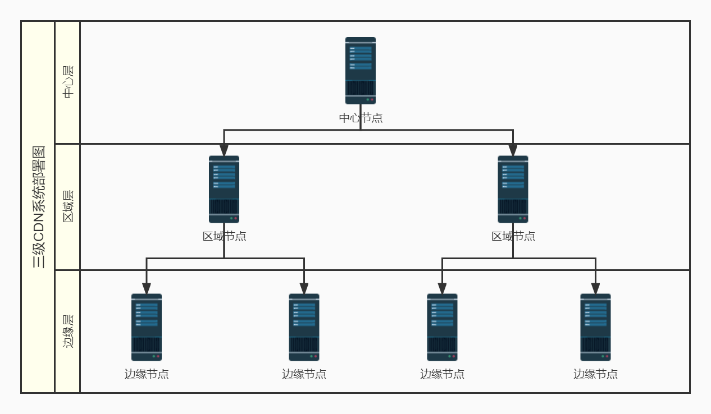

# 第2章 CDN技术概述
## 2.1 CDN的系统架构
### 2.1.1 功能架构
CDN技术1998年诞生，2003年左右基本成型和稳定。从功能上划分，典型的CDN系统架构由三部分构成
* 分发服务系统：将内容从内容源中心向边缘的推送和存储，承担实际的内容数据流的全网分发工作和面向最终用户的数据请求服务。
* 负载均衡系统
* 运营管理系统

**分发服务系统**

分发服务系统最基本的工作单元就是Cache设备（缓存服务器）。

根据承载内容和服务种类的不同，分发服务系统会分为多个子服务系统，如：
* 网页加速子系统
* 流媒体加速子系统
* 应用加速子系统

每个子服务系统都是一个分布式服务集群。Cache设备的数量、规模、总服务能力是衡量一个CDN系统服务能力的最基本的指标。

对于分发服务系统，除了承担内容更新、同步、响应用户需求的同时还需要向上层的调度控制系统提供每个Cache设备的健康状况信息、响应情况，有时还需要提供内容分布信息，以便调度控制系统决策。

**负载均衡系统**

主要功能是负责对所有发起服务请求的用户进行访问调度，确定提供给用户的最终实际访问地址。

**运营管理系统**

负责处理业务层面的与外界交互所必须的一些手机、整理、交付工作，主要包含：
* 客户管理：收集使用CDN的客户进行基本信息和业务规则的管理
* 产品管理：包括属性描述、产品生命周期管理、产品审核、客户产品状态变更等
* 计费管理：根据用户使用情况计算账单
* 统计分析：对各种数据形成报表

### 2.1.2 部署架构
节点是CDN系统中最基本的部署单元，由大量的、地理位置分散的POP(point of presence，也称边缘)节点组成，为用户就近提供内容访问服务。中心和区域节点一般成为骨干点，主要作为内容分发和边缘未命中时的服务节点。从节点构成上来说，无论骨干点还是POP点，都由Cache设备和本地负载均衡设备构成。

