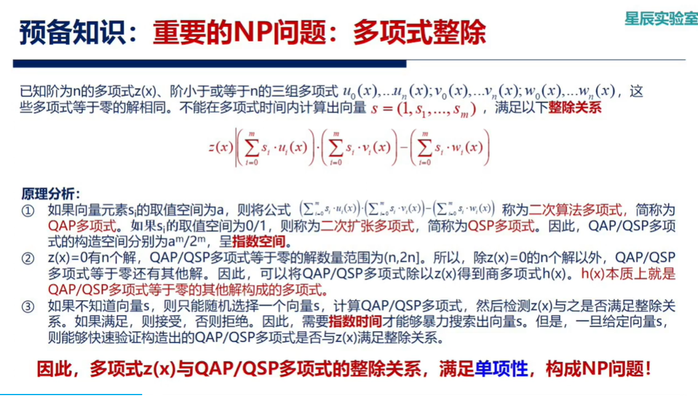
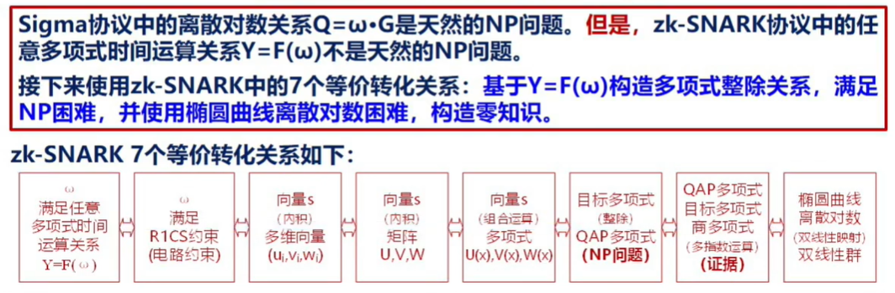
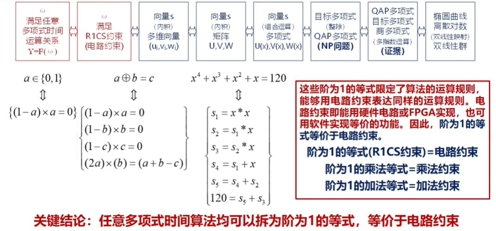
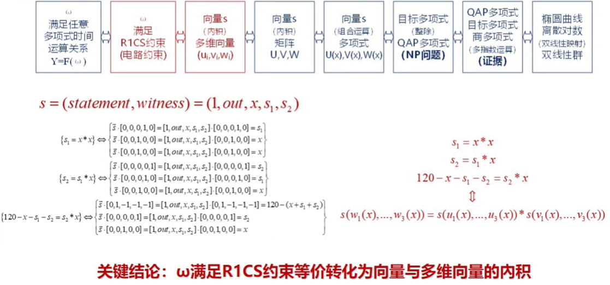
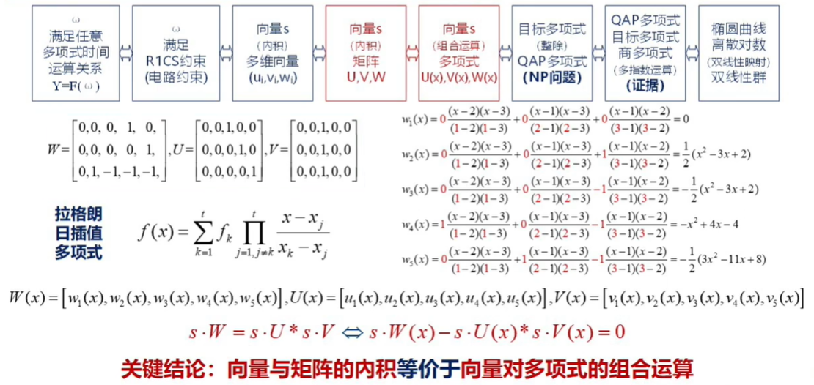
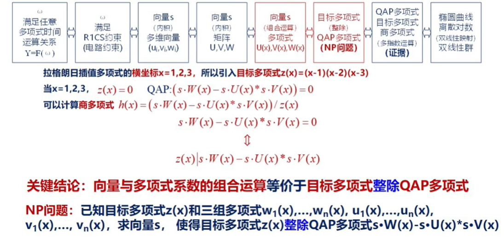

# 预备知识

## 零知识证明
场景：
- 可验证的透明性（证明者有验证者无法具有的能力）
  - 阿里巴巴（正常）和四十大盗（色盲），四十大盗交换红球绿球让阿里巴巴回答
  - 皇帝的新装，找两个侍卫，让其中一个骗子给某一个侍卫穿上衣服，再让另一个骗子来回答给哪个侍卫穿上了衣服
- 零知识（验证者可以拥有证明者的能力，但证明者确保没有透露任何信息）
  - 穿有进口和出口的山洞，不让验证者看到从哪边进，只让验证者提从哪边出的需求并满足
- 揭露过程不具有还原性
  - 数独，把答案的牌子背扣在桌面上，把每一行或者每一列或者每一格（9个）收到袋子里面洗牌，所有的袋子打开之后全是1~9
  - 染色问题，揭露后可重新替换编码对应的颜色

## 重要的NP问题：多项式整除

分母部分(z)所有括号最大次数为n，分子部分(QAP)第一个括号和第二个括号相乘则最大次数为2n

## 命题：多项式的值表达等价于多项式的系数表达
1. 已知(x1, y1), ..., (xn, yn)，能够在多项式实践内求解出多项式的系数k1, ..., kn
2. 已知变量x1, ..., xn和多项式的系数k1, ..., kn，能够在多项式时间内计算多项式的值y1, ..., yn

## Sigma零知识证明协议
对于椭圆曲线离散对数计算：PK = sk * G，已知PK和G，无法在多项式时间内计算出sk

零知识证明目标：证明方证明其知道ω且ω满足离散对数关系Q = `ω` * G

Sigma零知识证明协议步骤：
1. 系统参数：椭圆曲线生成元G
2. 承诺：证明方选择一个随机数r，计算并发送椭圆曲线离散对数点：C := `r` * G
3. 挑战：验证方随机选择一个随机数e并发送
4. 响应：证明方基于随机数e构造并发送z := `r` + e * `ω`
5. 基于e和z分别计算 z * G, e * Q 
   z * G = (`r` + e * `ω`) * G = `r` * G + e * `ω` * G = C + e * Q 
   至此，证明方证明了自己知道 `ω`，使得 Q = `ω` * G

💡 `r` 存在的意义在于隐藏 `ω`

# 零知识证明扩展
## Sigma协议扩展：zk-SNARK简洁非交互式零知识论证
ω满足任意多项式时间运算关系Y=F(ω)

七个等价关系：

[拉格朗日插值多项式](https://blog.csdn.net/weixin_47210960/article/details/119428254)

把矩阵用多项式来表征，下图中的多项式的解均为 x = 1, 2, 3

h(x) = 0 的解就是QAP多项式等于零的其他解构成的多项式

