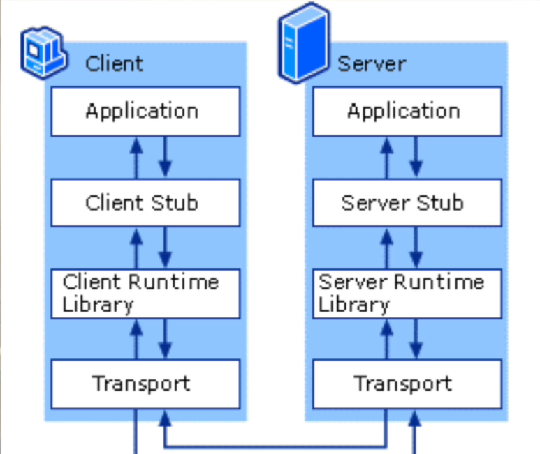

stub让程序感觉自己调用了一个本地函数


gRPC四种服务类型：
- Unary: 请求响应模式
- Client-side streaming: 客户端上传流数据到服务器，完成后服务器响应
- Server-side streaming: 客户端请求一次，服务器给客户端传输数据流
- bidirectional streaming: 双向数据流

## gRPC编写过程
编写 message 和 service

```proto
syntax = "proto3";

option go_package = "package_test/rpc/route";

package route;

message Point {
  int32 latitude = 1; // 1 为 tag(key) 而不是初始值，节省传输数据大小
  int32 longitude = 2;
}

message Rectangle {
  Point lo = 1;
  Point hi = 2;
}

message Feature {
  string name = 1;
  Point location = 2;
}

message RouteSummary {
  int32 point_count = 1;
  int32 distance = 2;
  int32 elapsed_time = 3;
}

enum RecommendationMode {
  GetFarthest = 0;
  GetNearest = 1;
}

message RecommendationRequest {
    RecommendationMode mode = 1;
    Point point = 2;
}

service RouteGuide {
  rpc GetFeature(Point) returns (Feature) {}
  rpc ListFeatures(Rectangle) returns (stream Feature) {}
  rpc RecordRoute(stream Point) returns (RouteSummary) {}
  rpc Recommend(stream RecommendationRequest) returns (stream Feature) {}
}
```

产生代码桩