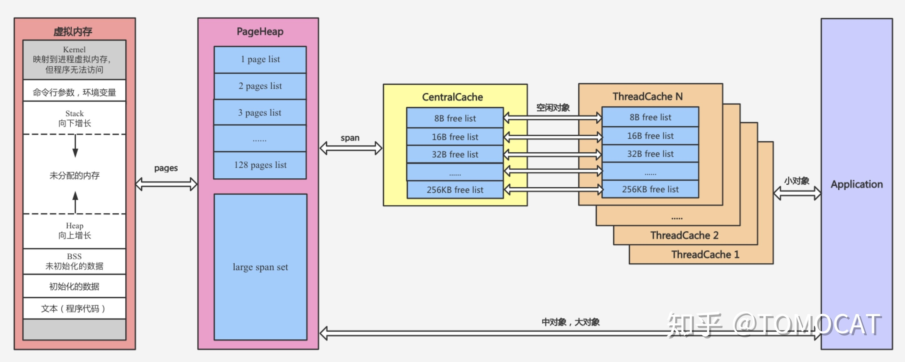
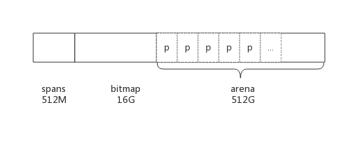
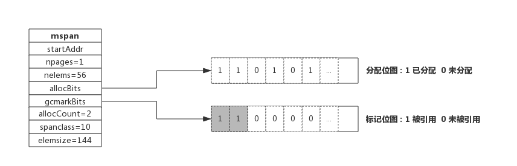

# 内存管理

## Go内存管理前身：tcmalloc
### 简介
tcmalloc全称为thread-caching malloc，是google推出的一种内存管理器。按照对象所占内存空间的大小，tcmalloc将对象划分为三类：
* 小对象：​(0, 256KB]
* 中对象：(256KB, 1MB]
* 大对象：(1MB, +∞]

相关重要概念：
* Page：tcmalloc将虚拟地址空间划分为多个大小相同的页Page（大小为8KB）
* Span：是tcmalloc向操作系统申请内存的基本单位，单个Span包含一个或多个Page，Span会记录起始page的PageID（start）以及所包含page的数量（length）。span中包含两个Span类型的指针（prev，next），用于将多个span以链表的形式存储。
* Size Class：对于256KB以内的小对象，tcmalloc按照大小划分了不同的Size Class，比如8字节、16字节和32字节等，以此类推。应用程序申请小对象需要的内存时，tcmalloc会将申请的内存向上取整到某个Size Class的大小
* ThreadCache：每个线程自己维护的缓存，里面对于每个Size Class都有一个单独的FreeList，缓存了n个还未被应用程序使用的空闲对象
* CentralCache：同样对于每个Size Class都维护了一个Central Free List来缓存空闲对象，作为各个ThreadCache获取空闲对象，每个线程从CentralCache中取用或者回收对象是需要加锁的，为了平摊加锁解锁的时间开销，一般一次会取用或者回收多个空闲对象
* PageHeap：当Centralache中的空闲对象不够用时会向PageHeap申请一块内存然后再拆分成各个Size Class添加到对应的CentralFreeist中。PageHeap对不同内存块Span的大小采用了不同的缓存策略：128 Page以内的Span每个大小都用一个链表来缓存，超过128 Page的Span存储在一个有序set中



### 小对象分配
小对象(0, 256KB]从TreadCache和CentralCache中获取，*ThreadCache和CentralCache只缓存小对象*。分配流程如下：
* 将对象大小向上取整到对应的Size Class
* 如果ThredCache FreeList非空则直接移除FreeList第一个空闲对象并返回，分配结束
* 如果ThredCache FreeList为空，从CentralCache中该SizeClass对应的CentralFreeList加锁一次性获取一堆空闲对象，（如果CentralFreeList也为空的则向PageHeap申请一个Span拆分成Size Class对应大小的空闲对象，放入CentralFreeList中）将这堆对象（除第一个对象外）放到ThreadCache中Size Class对应的FreeList，返回第一个对象，分配结束

### 中对象分配
中对象(256KB, 1MB]从PageHeap中获取，分配流程如下：
* 将该对象所需要的内存向上取整到k(k <=128)个Page，因此最多会产生8KB的内存碎片
* 从PageHeap中的k pages list的链表中开始按顺序找到一个非空的链表（假如是n pages list, n>=k），取出这个非空链表中的一个span并拆分成k pages和n-k pages的两个span，前者作为分配结果返回，后者插入到n-k pages list

### 大对象分配
对于超过128 pages的大对象，分配策略如下：
* 将该对象所需要的内存向上取整到k个page
* 搜索large span set，找到不小于k个page的最小span（假如是n pages），将该span拆成k pages和n-k pages的两个span，前者作为结果返回，后者根据是否大于128 pages选择插入到n-k pages list或者large span set
* 如果找不到合适的span，使用sbrk或者mmap向系统申请新的内存生成新的span，再执行一次大对象的分配算法

## Go内存管理-内存分配原理
### 简介
Golang的内存管理包含内存管理单元、线程缓存、中心缓存和页堆四个重要的组件，分别对应runtine.mspan、runtime.mcache、runtime.mcentral和runtime.mheap。



每一个Go程序在启动时都会向操作系统申请一块内存（仅仅是虚拟的地址空间，并不会真正分配内存），在X64上申请的内存会被分成512M、16G和512G的三块空间，分别对应spans、bitmap和arena。

* arena：堆区，运行时该区域每8KB会被划分成一个页，存储了所有在堆上初始化的对象
* bitmap：标识arena中哪些地址保存了对象，bitmap中一个字节的内存对应arena区域中4个指针大小的内存，并标记了是否包含指针和是否扫描的信息（一个指针大小为8B，因此bitmap的大小为512GB/(4*8)=16GB）
* spans：存放mspan的指针，其中每个mspan会包含多个页，spans中一个指针（8B）表示arena中某一个（至少一个）page（8KB），因此spans的大小（至多）为512GB/(1K)=512MB


### mspan
span是用于管理arena页的关键数据结构，每个span中包含1个或多个连续页，为了满足小对象分配，span中的一页会划分更小的粒度，而对于大对象比如超过页大小，则通过多页实现。

#### class
|class|bytes-obj|bytes-span|objects|waste bytes|
|---|---|---|---|---|
|1|8|8192| 1024|0
|2|16|8192|512|0
|3|32|8192|256|0
|4|48|8192|170|32
|5|64|8192|128|0
|6|80|8192|102|32
|7|96|8192|85|32
|...|
|32|1152|8192|7|128
|33|1280|8192|6|512
|34|1408|16384|11|896
|35|1536|8192|5|512
|36|1792|16384|9|256
|...|
|63|24576|24576|1|0
|64|27264|81920|3|128
|65|28672|57344|2|0
|66|32768|32768|1|0

上表可见最大的对象是32K大小，超过32K大小的由特殊的class表示，该class ID为0，每个class只包含一个对象。
### mcache
Golang为每个线程分配了span的缓存，这个缓存即是cache。
```go
type mcache struct {
    alloc [67*2]*mspan // 按class分组的mspan列表
}
```
数组中每个元素代表了一种class类型的span列表，每种class类型都有两组span列表，第一组列表中所表示的对象中包含了指针，第二组列表中所表示的对象不含有指针，这么做是为了提高GC扫描性能，对于不包含指针的span列表，没必要去扫描。

根据对象是否包含指针，将对象分为noscan和scan两类，其中noscan代表没有指针，而scan则代表有指针，需要GC进行扫描。


### mcentral
mcentral为所有线程的提供切分好的mspan资源，每个mcentral会保存一种特定大小的全局mspan列表，包括已分配出去的和未分配出去的。

central是全局资源，为多个线程服务，当某个线程内存不足时会向central申请，当某个线程释放内存时又会回收进central。

```go
type mcentral struct {
    lock mutex         // 互斥锁
    sizeclass int32    // 规格
    nonempty mSpanList // 尚有空闲object的mspan链表
    empty mSpanList    // 没有空闲object的mspan链表，或者是已被mcache取走的msapn链表
    nmalloc uint64     // 已累计分配的对象个数
}
```

### mheap
每个mcentral对象只管理特定的class规格的span，mcentral的集合存放于mheap数据结构中。Golang通过一个mheap类型的全局变量进行内存管理。

```go
type mheap struct {
    lock      mutex

    spans []*mspan

    bitmap        uintptr     //指向bitmap首地址，bitmap是从高地址向低地址增长的

    arena_start uintptr        //指示arena区首地址
    arena_used  uintptr        //指示arena区已使用地址位置

    central [67*2]struct {
        mcentral mcentral
        pad      [sys.CacheLineSize - unsafe.Sizeof(mcentral{})%sys.CacheLineSize]byte
    }
}
```


## Go内存管理-垃圾回收原理
垃圾回收的核心就是标记出哪些内存还在使用中（即被引用到），哪些内存不再使用了（即未被引用），把未被引用的内存回收掉，以供后续内存分配时使用。
### 内存标记(Mark)
在span数据结构中还有另一个位图gcmarkBits用于标记内存块被引用情况。


### 三色标记法
三色只是为了叙述上方便抽象出来的一种说法，实际上对象并没有颜色之分。这里的三色，对应了垃圾回收过程中对象的三种状态：
* 灰色：对象还在标记队列中等待检查是否被引用
* 黑色：对象已被标记，gcmarkBits对应的位为1（该对象不会在本次GC中被清理）
* 白色：对象未被标记，gcmarkBits对应的位为0（该对象将会在本次GC中被清理）

1. 初始状态下所有对象都是白色的
2. 遍历所有被引用的对象（广度遍历），将其标记为黑色
3. 黑色对象会被留下，白色被回收

## 参考
* [Golang内存管理](https:zhuanlan.zhihu.com/p/269621141)
* [C++性能优化（九）TCMalloc](https:blog.51cto.com/quantfabric/2568961)
* [Go专家编程-内存分配原理](https://www.topgoer.cn/docs/gozhuanjia/gozhuanjiachapter044.1-memory_alloc)