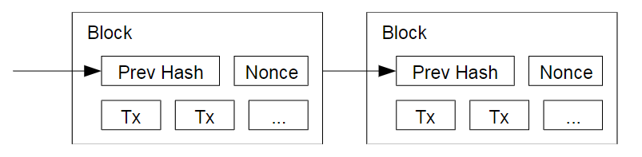
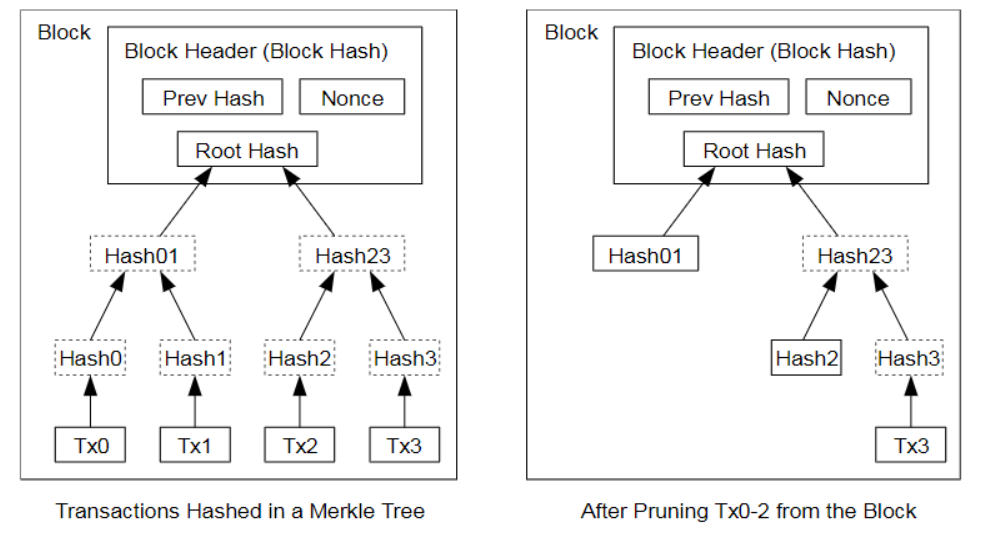

# Bitcoin: A Peer-to-Peer Electronic Cash System
source: https://bitcoin.org/bitcoin.pdf
## Abstract
**Target**: A purely peer-to-peer version of electronic cash would allow onlinepayments to be sent directly from one party to another **without going through a financial institution**.

**Block**: Digital signatures provide part of the solution, but the mainbenefits are lost if a trusted third party is still required to prevent **double-spending**.

**How to deal with it**: The network timestamps transactions by hashing them into an **ongoing chain of hash-based proof-of-work**, forming a record that **cannot be changed without redoing the proof-of-work**.

**Only the longest chain is valid**: The longest chain not only serves as proof of the sequence ofevents witnessed, but proof that it came from the largest pool of CPU power. *Aslong as a majority of CPU power is controlled by nodes that are not cooperating toattack the network, they'll generate the longest chain and outpace attackers.*

**Other premisees**:
* Messages are broadcast on a best effort basis.
  
  >消息在网络上尽最大努力广播
* nodes can leave and rejoin the network at will, accepting the longestproof-of-work chain as proof of what happened while they were gone.

  >重新加入网络时只认最长链

## 1. Introduction
**Why decentralize**: Commerce on the Internet has come to rely almost exclusively on financial institutions serving astrusted third parties to process electronic payments. While the system works well enough formost transactions, it still suffers from the inherent **weaknesses of the trust based model**. ... no mechanism exists to make paymentsover a communications channel without a trusted party.

**How to decentralize**: What is needed is an electronic payment system based on **cryptographic proof instead of trust**.  

**In this paper**: we propose a solution to the **double-spending problem** using a `peer-to-peer` `distributed` `timestamp` server to generate `computational proof` of the `chronological order` of transactions. *The system is secure as long as honest nodes collectively control more CPU power than any cooperating group of attacker nodes.*

## 2. Transactions
`electronic coin`: We define an electronic coin as a chain of digital signatures.

**How to transact**: Each owner transfers the coin to thenext by digitally signing a hash of the previous transaction and the public key of the next ownerand adding these to the end of the coin.

**How to verify**: A payee can verify the signatures to verify the chain of ownership.

> **非对称加密**：加密和解密用的是不同的密钥。 对于公私钥加密机制，持有者自己需要保管好私钥，对应的公钥是公开的。公钥可以对用私钥加密（签名过程）的密文进行解密，密钥可以对用公钥（加密过程）加密的密文进行解密。

> **交易流程**：用上图第二个交易举例，交易的流程即是转账方（Owner 1，也是上一笔交易的收款人）将上一笔交易和收款人（Owner 2）的公钥一起进行哈希，并用自己（Owner 1）的私钥对哈希值进行签名。当交易被确认后，即进行了成功的从转账方（Owner 1）到收款人的一笔交易。

**The problem**: The problem of course is the payee can't verify that one of the owners did not double-spendthe coin.

**Centralized solution**: A common solution is to introduce a trusted central authority, or mint, that checks everytransaction for double spending. After each transaction, the coin must be returned to the mint to issue a new coin, and only coins issued directly from the mint are trusted not to be double-spent.
> 利用中心化可信机构，每次交易都回收并重新铸币

**Put all transactions together**: We need a way for the payee to know that the previous owners did not sign any earlier transactions. For our purposes, **the earliest transaction is the one that counts**, so we don't care about later attempts to double-spend. The only way to confirm the absence of a transaction is tobe aware of all transactions. In the mint based model, the mint was aware of all transactions and **decided which arrived first**.

**How to accomplish this**:
* transactions must be publicly announced
* a system for participants to agree on **a single history of the order** in which they were received.
* The payee needs proof that at the time of each transaction, themajority of nodes agreed it was the first received.

  > 收款人需要自己确认大多数矿工都认可了这笔交易

## 3. Timestamp Server
**Procedure**: A timestamp server works by taking ahash of a block of items to be timestamped and widely publishing the hash. Each timestamp includes the previous timestamp inits hash, forming a chain, with each additional timestamp reinforcing the ones before it.

## 4. Proof-of-Work
**What is it used for**: To implement a distributed timestamp server on a peer-to-peer basis, we will need to use a proof-of-work system.

**How it works**: The proof-of-work involves scanning for a value that when hashed, such as with SHA-256, the hash begins with a number of zero bits. The average work required is exponential in the number of zero bits required and can be verified by executing a single hash.

**In bitcoin**: we implement the proof-of-work by incrementing a **nonce** in the block until a value is found that gives the block's hash the required zero bits.

**Tamper-Resistant** Once the CPU effort has been expended to make it satisfy the proof-of-work, the block cannot be changedwithout redoing the work. As later blocks are chained after it, the work to change the blockwould include redoing all the blocks after it.

**Block time control** To compensate for increasing hardware speed and varying interest in running nodes over time,the proof-of-work difficulty is determined by a moving average targeting an average number ofblocks per hour. If they're generated too fast, the difficulty increases.

## 5. Network
**How to forming the next block**
* New transactions are broadcast to all nodes.
* Each node collects new transactions into a block.
* Each node works on finding a difficult proof-of-work for its block.
* When a node finds a proof-of-work, it broadcasts the block to all nodes.
* Nodes accept the block only if all transactions in it are valid and not already spent.
* Nodes express their acceptance of the block by working on creating the next block in the chain, using the hash of the accepted block as the previous hash.

Nodes always consider the longest chain to be the correct one and will keep working onextending it.

**Fork**: If two nodes broadcast different versions of the next block simultaneously, some nodes may receive one or the other first. In that case, they work on the first one they received,but save the other branch in case it becomes longer. The tie will be broken when the next proof-of-work is found and one branch becomes longer; the nodes that were working on the otherbranch will then switch to the longer one.

**New transaction broadcasts do not necessarily need to reach all nodes.** As long as they reach many nodes, they will get into a block before long. **Block broadcasts are also tolerant of dropped messages.** If a node does not receive a block, it will request it when it receives the next block andrealizes it missed one.

## 6. Incentive
**Why miners mine**:
* **Coinbase transaction**: By convention, the first transaction in a block is a special transaction that starts a new coin ownedby the creator of the block. This adds an incentive for nodes to support the network, and providesa way to initially distribute coins into circulation, since there is no central authority to issue them.
* **Transaction fee**: The incentive can also be funded with transaction fees. If the output value of a transaction isless than its input value, the difference is a transaction fee that is added to the incentive value ofthe block containing the transaction. *Once a predetermined number of coins have entered circulation, the incentive can transition entirely to transaction fees and be completely inflationfree.*

**What can attackers get**: If a greedy attacker is able to assemble more CPU power than all the honest nodes, he would have to choose between: 
* using itto defraud people by stealingp back his ayments
* or using it to generate new coins.

**Be honest**:
He ought tofind it more profitable to play by the rules, such rules that favour him with more new coins thaneveryone else combined, than to undermine the system and the validity of his own wealth.

## 7. Reclaiming Disk Space
Once the latest transaction in a coin is buried under enough blocks, the spent transactions beforeit can be discarded to save disk space.

**Using Merkle Tree**: To facilitate this without breaking the block's hash,transactions are hashed in a Merkle Tree, with only the root included in the block's hash. Old blocks can then be compacted by stubbing off branches of the tree. The interior hashes donot need to be stored.

**Practicability**: A block header with no transactions would be about 80 bytes. If we suppose blocks aregenerated every 10 minutes, 80 bytes * 6 * 24 * 365 = 4.2MB per year. With computer systemstypically selling with 2GB of RAM as of 2008, and Moore's Law predicting current growth of1.2GB per year, storage should not be a problem even if the block headers must be kept in memory.

## 8. Simplified Payment Verification
It is possible to verify payments without running a full network node.

A user only needs to:
* keepa copy of the block headers of the longest proof-of-work chain, which he can get by querying network nodes until he's convinced he has **the longest chain**.
*  obtain the Merkle branchlinking the transaction to the block it's timestamped in.

He can't check the transaction forhimself, but by linking it to a place in the chain, he can see that a network node has accepted it,and blocks added after it further confirm the network has accepted it.

## 9. Combining and Splitting Value
**How to spend part value in a transaction**: To allow value to be split and combined, transactions contain multiple inputs and outputs. Normally there will be either a single input from a larger previous transaction or multiple inputs combining smaller amounts, and at most two outputs: one for the payment, and one returning the change, if any, back to the sender.

## 10. Privacy
**Privacy in banking model**: The traditional banking model achieves a level of privacy by limiting access to information to theparties involved and the trusted third party.

**In bitcoin**: The necessity to announce all transactions publicly precludes this method, but privacy can still be maintained by breaking the flow of information in another place: by **keeping public keys anonymous**. The public can see that someone is sending an amount to someone else, but **without information linking the transaction to anyone**. *This is similar to the level of information released by stock exchanges, where the time and size ofindividual trades, the "tape", is made public, but without telling who the parties were.*

## 11. Calculations
**What can attackers get**: Nodes are not going to accept an invalid transaction as payment, and honest nodes will never accept a block containing them. **An attacker can only try to change one of his own transactions to take back money he recently spent**.

The race between the honest chain and an attacker chain can be characterized as a BinomialRandom Walk. ...

The probability of an attacker catching up from a given deficit is analogous to a Gambler'sRuin problem.

